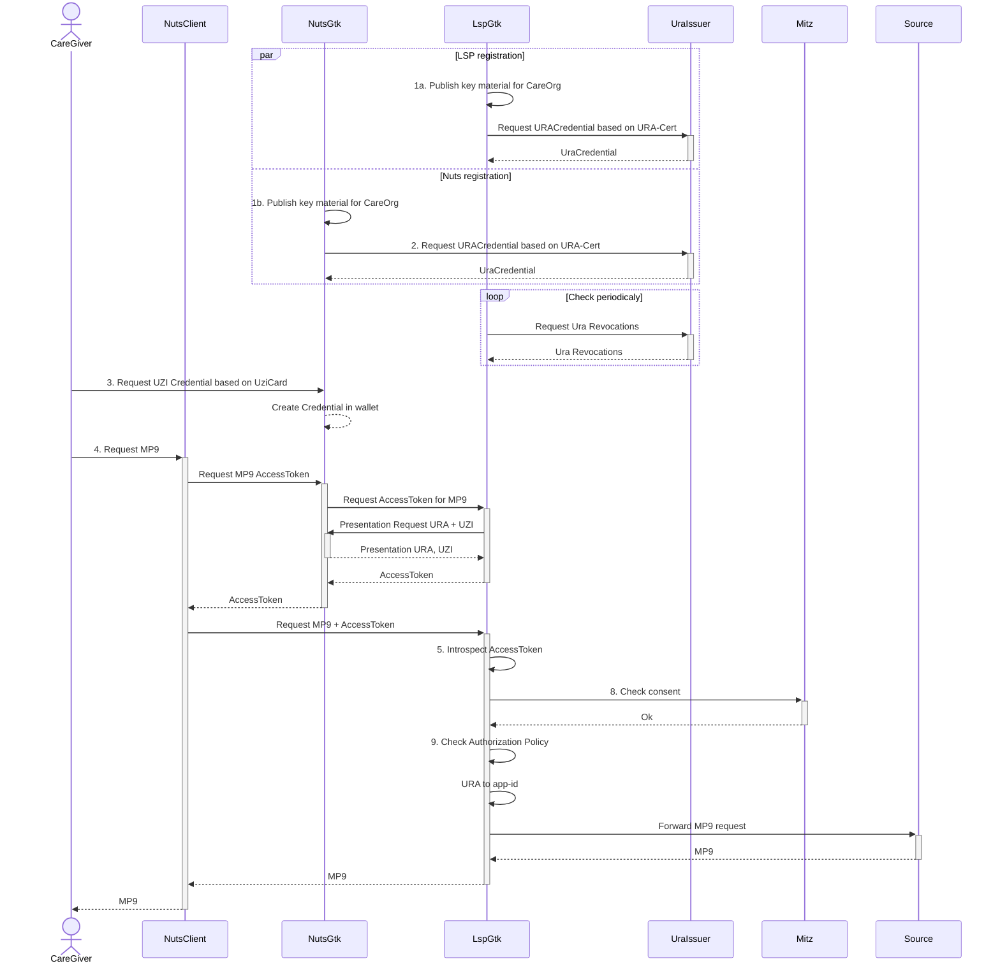

# Beproevingen

We gaan uit van het ondersteunen van het medicatie proces voor de langdurige zorg.

Naast te technische interoperabiliteit zullen de volgende punten moeten oplossen:
- Niet alle zorgverleners hebben momenteel beschikking over een UZI nummer, rolcode en middel
- UZI passen zijn niet mobiel te gebruiken
- De autorisatie richtlijn voor het MP9 proces autoriseert op basis van rolcodes. Zonder rolcode kan een zorgverlener zich niet autoriseren.

Er is gekozen om in plateaus te werken waarbij we ons in het begin focussen op technische interoperabiliteit en werken in latere plateaus de bovenstaande vragen verder uit.

## Plateau 1

**Scope**: Gerichte bevraging voor een MP9-dataset door een zorgverlener via een NutsGtk naar het LSPGtk.

Authenticatie van organisatie en zorgverlener op basis van Verifiable Credentials, zelf uitgegeven door te ondertekenen met de respectievelijke URA en UZI certificaten.

Hiervoor kan gebruik worden gemaakt van de huidige autorisatierichtlijnen van het MP9 programma.

### Punten die we moeten uitzoeken
1. Kun je UZI en URA credentials aanmaken op basis van een pas en certificaat?
2. Kunnen we gebruik maken van het publieke internet of moet de raadplegende organisatie ook aansluiten op een GBZ?
3. Hoe lokaliseert de raadplegende organisatie de bronhouder?
4. Treedt het LSP hier op als verwerker voor de bronhouder of als zelfstandige gegevensverwerker?
5. Aanvullend op punt 4, verzameld de LSPGtk gegegevens van meerdere bronnen, of dient de raadpleger zelf meerdere bronnen te raadplegen voor een volledig dataset?

Oorspronkelijke transacties:
1. AORTA zorgaanbieders geregisteerd in AORTA- GTK nuts node: DID
2. Nuts Zorgaanbieder gebruikt UZI-servercertificaat om URA credentials aan eigen DID te koppelen
3. Nuts Zorgverlener gebrikt UZI-pas om UZI-nummer credential en UZI-rolcode credential aan te maken in wallet
4. Raadpleging medicatie: gerichte medicatiequery. 
5. LSP (GtK) controleert: a) VC gebruiker (UZI en rol), b) VC zorgaanbieder (URA), c) VC Nutsnode-Zorgaanbieder
6. Nuts node controleert: a) VC Nutsnode(LSP)-zorgaanbieder
7. LSP (GtK) mapt URA op app-id
8. LSP checkt toestemming bij Mitz
9. LSP autoriseert op UZI-rolcode volgens acuteel Medicatie autorisatieprotocol

Uitgewerkt in een sequentie diagram:

